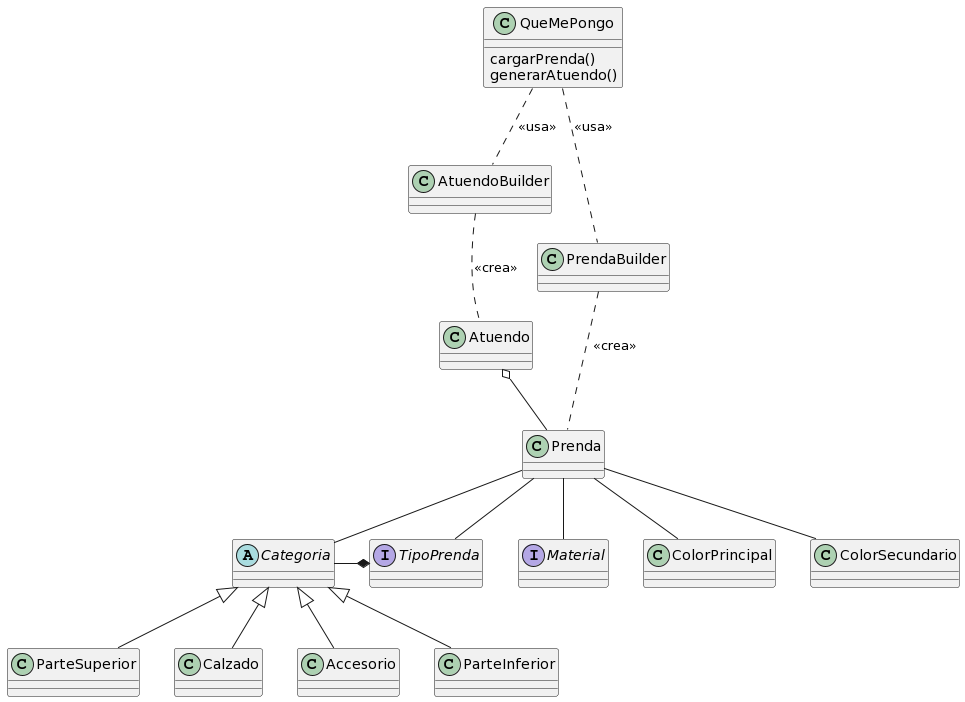

Como usuarie de QuéMePongo, quiero especificar qué tipo de prenda estoy cargando (zapatos, camisa de mangas cortas, pantalón, etc).
```java
enum TipoPrenda{

  Categoria categoria;

  TipoPrenda(categoria)

  ZAPATO(Categoria.CALZADO),
  CAMISA(Categoria.SUPERIOR),
  PANTALON(Categoria.INFERIOR)
}
```
Como usuarie de QuéMePongo, quiero identificar a qué categoría pertenece una prenda (parte superior, calzado, parte inferior, accesorios).
```java
enum Categoria{ SUPERIOR, CALZADO, INFERIOR, ACCESORIO }
```
Como usuarie de QuéMePongo, quiero poder indicar de qué tela o material está hecha una prenda
```java
enum Material{ ... }
```
Como usuarie de QuéMePongo, quiero poder indicar un color principal para mis prendas
Como usuarie de QuéMePongo, quiero poder indicar, si existe, un color secundario para mis prendas.

```java
class Color{
  Int red;
  Int green;
  Int blue;
}
```
- Como usuarie de QuéMePongo, quiero evitar que haya prendas sin tipo, tela, categoría o color primario.
- Como usuarie de QuéMePongo, quiero evitar que haya prendas cuya categoría no se condiga con su tipo. (Ej, una remera no puede ser calzado
```java
class Prenda {
  TipoPrenda tipo;
  Material material;
  Color colorPrimario;
  Color colorSecundario;

  Prenda(TipoPrenda tipoPrenda, Material material, Color colorPrimario)
    if (tipoPrenda == null || material == null || colorPrimario == null)
      throw new PrendaException("Debe indicar tipo, material y color primario")
      
  public Categoria getCategoria(){
    return tipo.getCategoria()
  }
}

class PrendaException extrends RuntimeException
```

# DdS-QueMePongo


